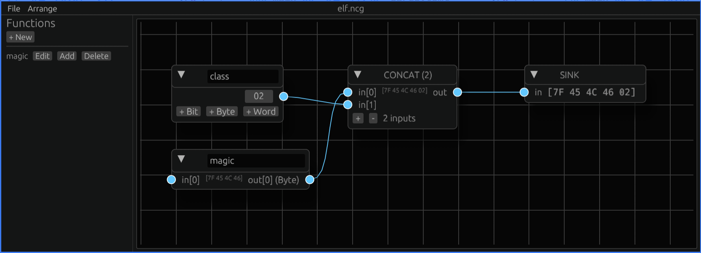

# Node-Based Compiler

This project was inspired by [*Kronark*](https://www.youtube.com/@Kronark).

My hope is that I can make enough simple primitives to create executable binaries and self-host the editor interface.

Right now I'm just testing out ideas. Very much a work in progress.

## Known issues

- Sometimes the nodes are auto-arranged from top-to-bottom differently than the order the wires connect.
- No ability to copy and paste nodes.
